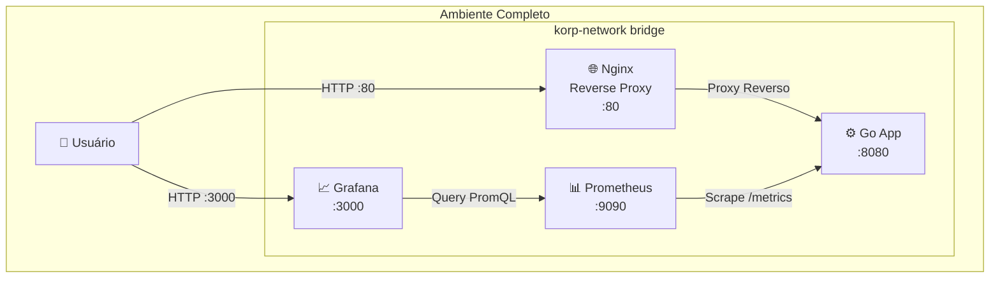

# Desafio DevOps - Korp ERP

## 🎯 Objetivo

Solução completa para o desafio técnico da Korp ERP, implementando:
- Serviço HTTP em Go com métricas Prometheus
- Arquitetura de containers com Nginx como Reverse Proxy
- Stack de observabilidade (Prometheus + Grafana)
- Automação total com Ansible (Zero to Hero)

## 🏗️ Arquitetura




## 📂 Estrutura do Projeto

```
desafio-korp/
├── ansible/
│   ├── inventory/
│   │   ├── group_vars/
│   │   │   └── korp_target/
│   │   │       └── main.yml
│   │   └── hosts.ini
│   └── playbooks/
│       ├── hardening.yml      # Hardening base (SSH, UFW, usuários)
│       ├── docker-setup.yml   # Instalação do Docker
│       └── site.yml           # Playbook mestre (orquestra tudo)
├── app-go/
│   ├── main.go                # Aplicação Go com métricas Prometheus
│   ├── go.mod
│   ├── go.sum
│   └── Dockerfile             # Multi-stage build, non-root, Alpine
├── grafana/
│   ├── dashboards/
│   │   └── korp-dashboard.json  # Dashboard provisionado automaticamente
│   └── provisioning/
│       ├── dashboards/
│       │   └── dashboard.yml
│       └── datasources/
│           └── datasource.yml
├── nginx/
│   └── conf.d/
│       └── http-server-projeto-korp.conf  # Configuração do Reverse Proxy
├── prometheus/
│   └── prometheus.yml         # Configuração de scrape
├── docker-compose.yml         # Orquestração de todos os containers
└── README.md
```

## 🚀 Como Executar

### Pré-requisitos
- Ubuntu Server 26
- Ansible >= 2.15 instalado no control node
- Chave SSH configurada para acesso ao target

### Execução (Um único comando)

```bash
# Clone o repositório
git clone https://github.com/GamaGustavo/desafio-korp.git
cd desafio-korp

# Configure o inventory com o IP do seu servidor
vim ansible/inventory/hosts.ini

# Configure as variaveis com o usuário do seu servidor
vim ansible/inventory/group_vars/korp_target/main.yml

# Execute o playbook mestre
ansible-playbook -i ansible/inventory/hosts.ini ansible/playbooks/site.yml
```

O playbook vai:
1. Aplicar hardening de segurança (SSH, UFW)
2. Instalar Docker Engine + plugins
3. Copiar a estrutura do projeto para `/opt/desafio-korp`
4. Buildar a imagem Go e subir todos os containers
5. Validar o funcionamento via HTTP

### Acesso aos Serviços

Após a execução:
- **API**: `http://<IP_DO_SERVIDOR>/projeto-korp`
- **Grafana**: `http://<IP_DO_SERVIDOR>:3000` (admin/Senha_Forte_Deve_Ser_Passada_Por_Vault)

## 🧪 Testes

### Teste da API
```bash
curl http://<IP_DO_SERVIDOR>/projeto-korp
# Esperado: {"nome":"Projeto Korp","horario":"2026-08-03T17:56:36Z"}
```

### Teste de Métricas
```bash
# Dentro do servidor, via rede Docker
docker exec prometheus wget -qO- http://http-server-projeto-korp:8080/metrics
```

### Dashboard do Grafana
Acesse `http://<IP_DO_SERVIDOR>:3000` e navegue até o dashboard "Korp App - Observabilidade".

## 🔒 Decisões Técnicas

### Por que não expor a porta 8080 do Go?
Segurança por design. A aplicação fica isolada na rede Docker interna, acessível apenas pelo Nginx (Reverse Proxy). Isso reduz a superfície de ataque e permite adicionar WAF, rate limiting e terminação SSL no Nginx no futuro.

### Por que usar `synchronize` em vez de `copy` no Ansible?
O módulo `synchronize` (rsync) suporta exclusões granulares (`.git`, `ansible/`, etc.), transfere apenas deltas (eficiência) e mantém imutabilidade com `delete: yes`. Para este repositório pequeno, `copy` funcionaria, mas pensei na escalabilidade e manutenção futura.

### Por que multi-stage build no Dockerfile?
Reduz o tamanho da imagem final de ~800MB para <20MB, remove dependências de compilação da imagem de runtime e reduz a superfície de ataque. O binário é compilado com `CGO_ENABLED=0` para compatibilidade com Alpine.

### Por que usuário non-root nos containers?
Defesa em profundidade. Se houver uma vulnerabilidade RCE na aplicação, o atacante fica preso como usuário sem privilégios (UID 1000), impedindo escalação de privilégios para o host.

## 📊 Métricas Implementadas

- **Disponibilidade**: `up{job="http-server-projeto-korp"}` (0 = DOWN, 1 = UP)
- **Volume de Requisições**: `korp_http_requests_total` (counter com labels: endpoint, method, status)
- **Taxa de Requisições**: `rate(korp_http_requests_total[1m])` (req/s)

## 🎁 Bônus: Provisionamento Automático do Grafana

O dashboard é provisionado automaticamente via arquivos YAML e JSON, sem necessidade de configuração manual na UI. Isso garante reprodutibilidade e imutabilidade.

## 📝 Licença

Este projeto foi desenvolvido como parte de um desafio técnico para a Korp ERP.

## 👤 Autor

Gustavo Avila Gama  
LinkedIn: [linkedin.com/in/gustavo-avila-gama](https://www.linkedin.com/in/gustavo-avila-gama)  
GitHub: [github.com/GamaGustavo](https://github.com/GamaGustavo)

